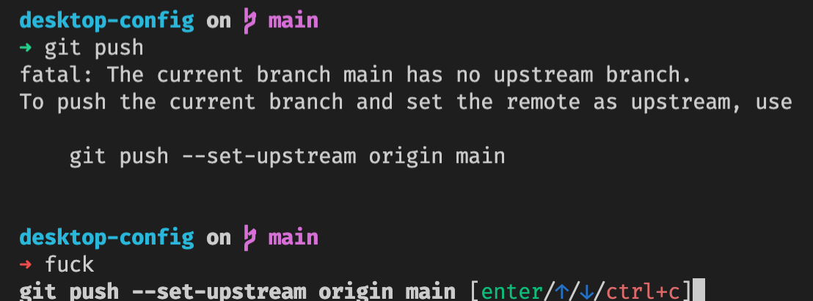

# Desktop Config

## One rice to rule them all

This repository's purpose is to have my desktop config available to anyone who likes it, as well as saving me time whenever I switch to a new computer.

### Font

#### Fira Code

https://github.com/tonsky/FiraCode

You need to **explicitly enable ligatures support** in VSC.

### Console

#### Oh my Zsh

https://ohmyz.sh/

#### Spaceship (Oh my zsh)

Eye-candy for consoles and gives info about branches, node versions, packages, among others.

https://spaceship-prompt.sh/

#### TheFuck

Helper that tries to execute that command you just failed to type.

https://github.com/nvbn/thefuck

### VSC Extensions

Name: ES7+ React/Redux/React-Native snippets

Id: dsznajder.es7-react-js-snippets

Description: Extensions for React, React-Native and Redux in JS/TS with ES7+ syntax. Customizable. Built-in integration with prettier.

Version: 4.4.3
Publisher: dsznajder

VS Marketplace Link: https://marketplace.visualstudio.com/items?itemName=dsznajder.es7-react-js-snippets

---

Name: Hide Node Modules

Id: chrisbibby.hide-node-modules

Description: Show/Hide Node Modules within the Explorer view

Version: 1.0.1

Publisher: Chris Bibby

VS Marketplace Link: https://marketplace.visualstudio.com/items?itemName=chrisbibby.hide-node-modules

---

Name: Image preview

Id: kisstkondoros.vscode-gutter-preview
Description: Shows image preview in the gutter and on hover

Version: 0.30.0

Publisher: Kiss Tamás

VS Marketplace Link: https://marketplace.visualstudio.com/items?itemName=kisstkondoros.vscode-gutter-preview

---

Name: Material Icon Theme

Id: PKief.material-icon-theme

Description: Material Design Icons for Visual Studio Code

Version: 4.17.0

Publisher: Philipp Kief

VS Marketplace Link: https://marketplace.visualstudio.com/items?itemName=PKief.material-icon-theme

---

Name: Prettier - Code formatter

Id: esbenp.prettier-vscode

Description: Code formatter using prettier
Version: 9.5.0

Publisher: Prettier

VS Marketplace Link: https://marketplace.visualstudio.com/items?itemName=esbenp.prettier-vscode

---
